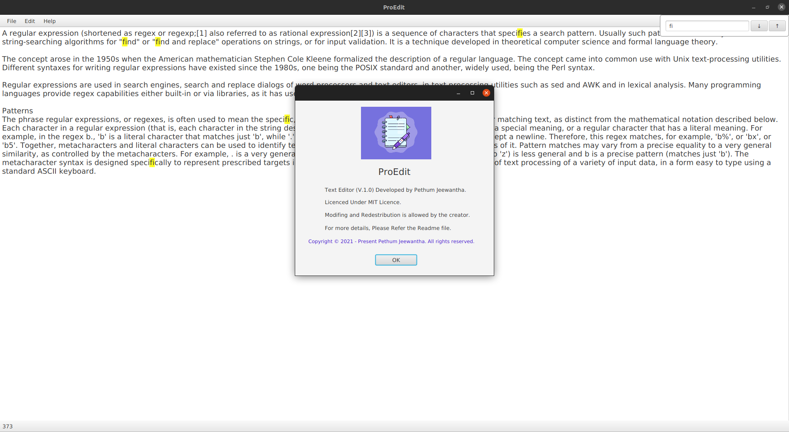

# ProEdit

[![Contributors][contributors-shield]][contributors-url]
[![Forks][forks-shield]][forks-url]
[![Stargazers][stars-shield]][stars-url]
[![Issues][issues-shield]][issues-url]
[![MIT License][license-shield]][license-url]
[![LinkedIn][linkedin-shield]][linkedin-url]

  
Table of Contents

  <ol>
    <li>
      <a href="#about-the-project">About The Project</a>
    </li>
    <li>
      <a href="#getting-started">Getting Started</a>
      <ul>
        <li><a href="#installation">Installation</a></li>
      </ul>
    </li>
    <li><a href="#usage">Usage</a></li>
    <li><a href="#license">License</a></li>
    <li><a href="#contact">Contact</a></li>
    <li><a href="#acknowledgements">Acknowledgements</a></li>
  </ol>

## About The Project

* This repository is a simple **Java FX Application** to study and demonstrate many Java and SE related stuff.

## Getting Started

### Installation

1. First clone the repository.

   ``git clone https://github.com/DEP-7-IJSE/Text-Editor.git``

2. Once cloned, open the repository from the IntelliJ IDEA

3. Then build and Run!

## Usage

* This editor can find and replace the text that the user has entered.
* It can also read and write files.
* After editing, the user can print it.

### License

Copyright &copy; 2021 - present Pethum Jeewantha. All rights reserved.

Licensed under the [MIT](LICENSE.txt) license.

## Contact

Pethum Jeewantha - [Twitter](https://twitter.com/JeewanthaPethum?s=08)  
pethumjeewantha4@gmail.com

[Project](https://https:github.com/DEP-7-IJSE/Text-Editor)

## Acknowledgements

* [Img Shields](https://shields.io)
* [Choose an Open Source License](https://choosealicense.com)

[contributors-shield]: https://img.shields.io/github/contributors/DEP-7-IJSE/Text-Editor.svg?style=for-the-badge

[contributors-url]: https://https://github.com/DEP-7-IJSE/Text-Editor/graphs/contributors

[forks-shield]: https://img.shields.io/github/forks/DEP-7-IJSE/Text-Editor.svg?style=for-the-badge

[forks-url]: https://github.com/DEP-7-IJSE/Text-Editor/network/members

[stars-shield]: https://img.shields.io/github/stars/DEP-7-IJSE/Text-Editor.svg?style=for-the-badge

[stars-url]: https://https://github.com/DEP-7-IJSE/Text-Editor/stargazers

[issues-shield]: https://img.shields.io/github/issues/DEP-7-IJSE/Text-Editor.svg?style=for-the-badge

[issues-url]: https://https://github.com/DEP-7-IJSE/Text-Editor/issues

[license-shield]: https://img.shields.io/github/license/DEP-7-IJSE/Text-Editor.svg?style=for-the-badge

[license-url]: https://https://github.com/DEP-7-IJSE/Text-Editor/blob/master/LICENSE

[linkedin-shield]: https://img.shields.io/badge/-LinkedIn-black.svg?style=for-the-badge&logo=linkedin&colorB=555

[linkedin-url]: https://www.linkedin.com/in/pethum-jeewantha-7b70aa1b1
