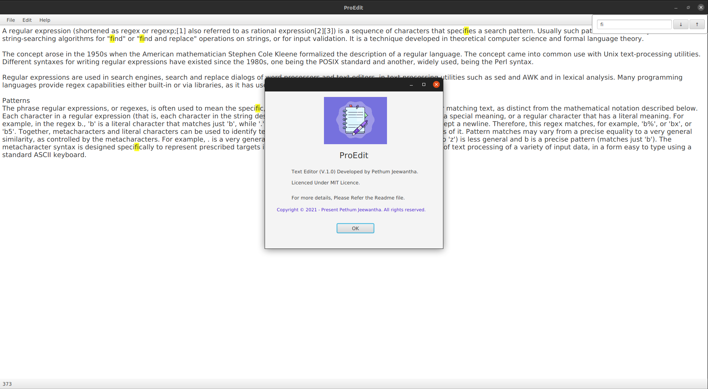

# ProEdit

### Contents of this file
* Introduction
* User guide
* License

---

### Introduction

* This repository is a simple **Java FX Application** to study and demonstrate many Java and SE related stuff.

---

### How to use this repository?

1. First clone the repository.

   ``git clone https://github.com/DEP-7-IJSE/Text-Editor.git``

2. Once cloned, open the repository from the IntelliJ IDEA

3. Then build and Run!

---

### License

Copyright &copy; 2021 - present Pethum Jeewantha. All rights reserved.

Licensed under the [MIT](LICENSE) license.
